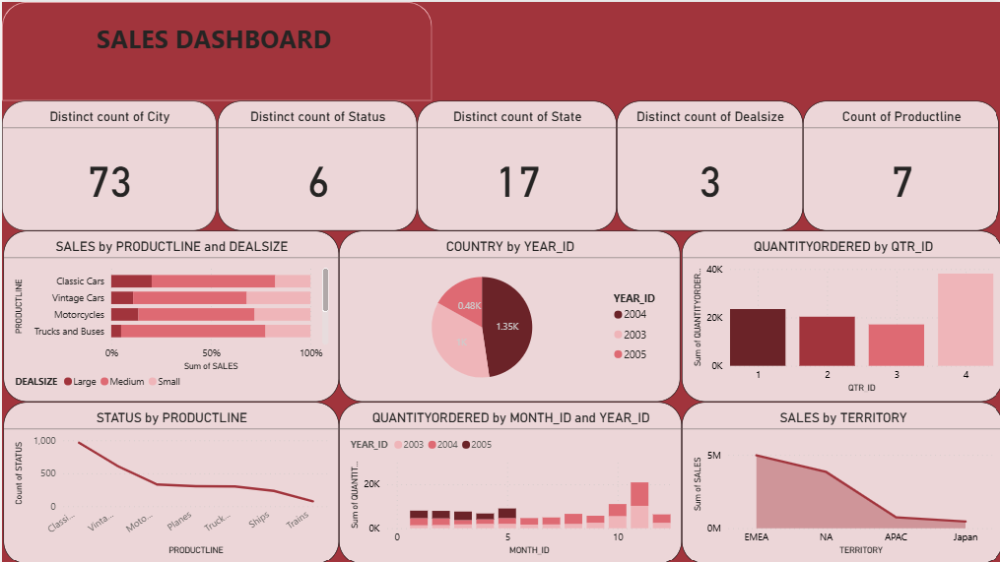

# Sales Dashboard Analysis Project

## Project Overview
This project presents a sales performance dashboard designed to analyze revenue trends, product performance, and regional sales distribution.

The dashboard helps businesses quickly understand sales patterns and make data-driven decisions.

## Tools Used
- Excel
- Pivot Tables
- Data Visualization
- Dashboard Design

## Key Insights
- Classic Cars generate the highest revenue among product lines.
- Large deal sizes contribute the most to total sales.
- Sales peaked in 2004 compared to other years.
- Quarter 4 recorded the highest order quantity.
- EMEA region produces the highest sales.

## Business Recommendations
- Focus marketing on top-performing products like Classic Cars.
- Encourage large deal transactions through promotions.
- Increase marketing efforts in low-performing regions such as APAC and Japan.
- Prepare inventory ahead of Quarter 4 when demand increases.

## Dashboard Preview

## Author
Oluwatoyin Adeyemo  
Aspiring Data Analyst / Data Scientist
